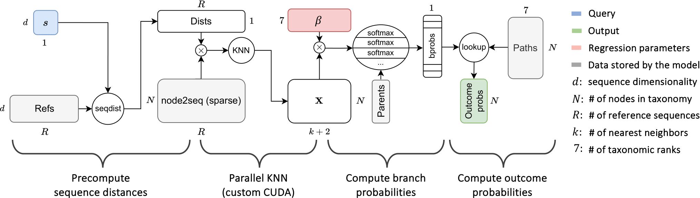

# PROTAX-GPU

<p align="center">
  
</p>

<p align="center">
  <!-- <a href="https://github.com/uoguelph-mlrg/PROTAX-GPU/actions"></a> -->
  <a href="https://your-username.github.io/PROTAX-GPU/"></a>
  <a href="https://github.com/uoguelph-mlrg/PROTAX-GPU/blob/main/LICENSE"></a>
  <a href="https://github.com/psf/black"></a>
</p>

A GPU-accelerated JAX-based implementation of [PROTAX](https://pubmed.ncbi.nlm.nih.gov/27296980/) for fast taxonomic classification of DNA barcode sequences.

## Quick Start

### 1. Install JAX

| System | Type | Command |
|--------|------|---------|
| Linux | CPU | `pip install "jax[cpu]"` |
| Linux | GPU | `pip install "jax[cuda12]"` |
| macOS | CPU | `pip uninstall jax jaxlib && conda install -c conda-forge jax=0.4.26 jaxlib=0.4.23` |
| macOS | GPU | Not yet supported |

**NOTE**: The GPU installation command assumes you have already installed CUDA 12.2 as per step 1.

### 2. Create & activate new environment (recommended)

```bash
conda create -n [name] python=3.12
conda activate [name]
```

### 3. Install PROTAX-GPU
```bash
git clone https://github.com/uoguelph-mlrg/PROTAX-GPU.git
cd PROTAX-GPU
pip install .
```

## Documentation

> **Note**: Documentation is being set up. Links will be active shortly.

**Complete documentation is available at: [protax-gpu.readthedocs.io](https://protax-gpu.readthedocs.io/)**

| Section | Description |
|---------|-------------|
| **[Installation Guide](https://protax-gpu.readthedocs.io/en/latest/installation.html)** | Detailed setup instructions |
| **[Usage Guide](https://protax-gpu.readthedocs.io/en/latest/usage.html)** | Command-line and Python API |
| **[API Reference](https://protax-gpu.readthedocs.io/en/latest/api.html)** | Complete function documentation |
| **[Examples](https://protax-gpu.readthedocs.io/en/latest/examples.html)** | Practical code examples |
| **[Experiments](https://protax-gpu.readthedocs.io/en/latest/experiments.html)** | Performance benchmarks and reproducibility |


## Requirements

- **Hardware**: NVIDIA GPU with 8GB+ memory (16GB+ recommended for large datasets)
- **Software**: Python 3.9+, CUDA 12.0+, JAX with CUDA support
- **Compatibility**: Linux (tested), macOS (CPU only), Windows (experimental)

### Compatibility Matrix

| **System** | **CPU** | **NVIDIA GPU** | **Apple GPU** |
|------------|---------|----------------|---------------|
| **Linux** | ✅ Full support | ✅ Full support | N/A |
| **macOS (Intel)** | ✅ Full support | N/A | ❌ Not supported |
| **macOS (Apple Silicon)** | ✅ Full support | N/A | ❌ Not supported |
| **Windows** | 🧪 Experimental | 🧪 Experimental | N/A |

## Performance

PROTAX-GPU achieves significant speedups over CPU-only implementations:

| Dataset Size | CPU Time | GPU Time | Speedup |
|--------------|----------|----------|---------|
| XX | XX | XX |XX |
| XX | XX | XX |XX |
| XX | XX | XX |XX |

*See [performance benchmarks](https://your-username.github.io/PROTAX-GPU/experiments.html) for detailed results.*


## License

This project is licensed under the [CC BY-NC-SA 4.0](https://creativecommons.org/licenses/by-nc-sa/4.0/) License - see the [LICENSE](LICENSE) file for details.

## Citation

If you use PROTAX-GPU in your research, please cite:

```bibtex
@article{protax_gpu_2024,
  title={PROTAX-GPU: Accelerated Taxonomic Classification with Graphics Processing Units},
  author={Li, Roy and others},
  journal={Methods in Ecology and Evolution},
  year={2024},
  note={In preparation}
}
```

And the original PROTAX paper:

```bibtex
@article{somervuo2016quantifying,
  title={Quantifying uncertainty of taxonomic placement in DNA barcoding and metabarcoding},
  author={Somervuo, Panu and Yu, Douglas W and Xu, Chengcheng C and Ji, Yinqiu and Hultman, Jenni and Wirta, Helena and Ovaskainen, Otso},
  journal={Methods in Ecology and Evolution},
  volume={8},
  number={4},
  pages={398--407},
  year={2017},
  publisher={Wiley Online Library}
}
```

## Dataset

- **[FinPROTAX](https://github.com/psomervuo/FinPROTAX)** - Smaller FinPROTAX dataset is included in the models directory.
- **[BOLD 7.8M](https://boldsystems.org/datarelease)** - DNA barcode database. The dataset is not included in this repository due to its size.

## Related Resources
- **[JAX](https://jax.readthedocs.io/)** - Machine learning framework

---

<p align="center">
  <a href="https://your-username.github.io/PROTAX-GPU/"><strong>Read the full documentation</strong></a>
</p>